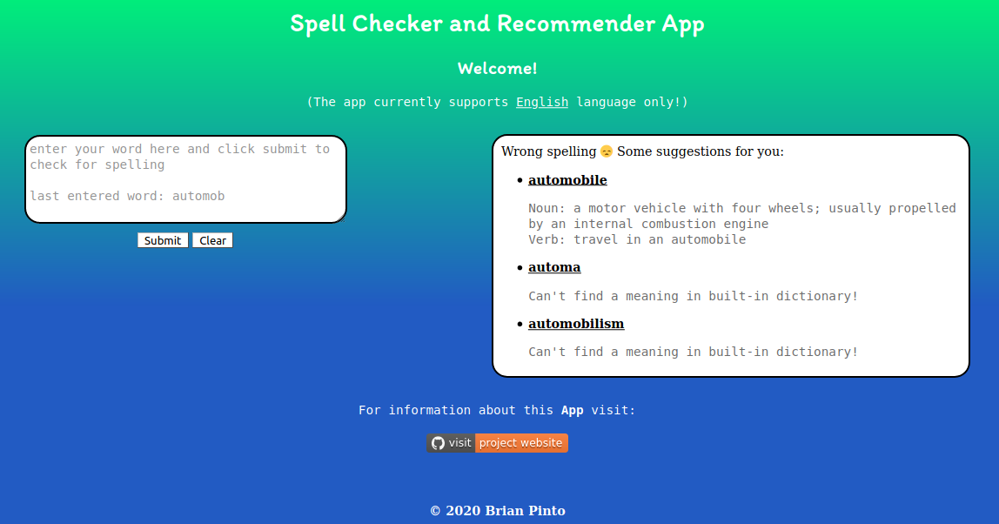

# Spell Checker and Recommender

[](https://travis-ci.com/brianpinto91/spell-checker-heroku-app)
[]()
[](https://www.codefactor.io/repository/github/brianpinto91/spell-checker-heroku-app)

A web application which can be used to get spelling recommendations for words entered by user in english language.

## Table of Contents
* [App](#app)
* [Motivation](#motivation)
* [Implementation](#implementation)
* [Installation](#installation)
* [Technologies](#technologies)
* [License](#license)

## App

Below is the screenshot of the application. You can check it out by clicking on the image.

[](https://spell-checker-eng.herokuapp.com/)

## Motivation

>The best way of learning about anything is by doing - Richard Branson

I took this project to explore [Flask][flask_link], [Gunicorn][gunicorn_link], [Jinja][jinja_link], [Heroku][heroku_link], and continous integration with [Travis CI][travis_link]. Also it was a good opportunity for me to refresh my **html** and **css** skills, by designing the frontend myself. This is just the start of many more complex machine learning and deep learning apps that I would be working on and deploying!

## Implementation

I used the [NLTK's Word Lists][nltk_corpus_link] as vocabulary for english. To check for the spelling, [Jaccard distance][jaccard_link] is used to find the dissimilarity of the input word with the words in the vocabulary starting with the same letter as the input word. The implmentation requires the words to be converted into set of appropriate [n-grams][ngrams_link]. For more information on this topic, you can read this [article][jaccard_article_link].

I thought it would also be useful if the user gets some suggestions for spellings together with the meaning, when they input a wrong word. The [PyDictionary][pydict_link] package for python provides a dictionary to get the meaning for the words.

For the deployment, [Heroku][heroku_link] application engine is used with [Flask][flask_link] served using [Gunicorn][gunicorn_link] (required in production web serving). I designed my own custom front end with **html** and **css**. 

## Installation

Since, I use Linux for software development, I am covering the installation for Linux / Mac OS.

### Clone the repository

On your computer, first navigate to the directory were you want to download the repository to. Then run the following commands:

```sh
mkdir spell-checker-app
cd spell-checker-app
git clone --depth 1 https://github.com/brianpinto91/spell-checker-heroku-app.git
```

### Setup Virtual Environment

The app is built and tested using **Python 3.6.12**. Follow this [guide][python_install_link] to install it. Create a virtual environment where you can install the dependencies to run the python program. Follow this [guide][venv_setup_link] to setup a virtual environment. Once you have created one, please make sure that you activate it using the command (subsitute **your_env_path** with the absolute path where you saved your environment)

```sh
source your_env_path/bin/activate
```

### Install the dependencies

Before you install the dependencies update your pip and setuptools using:

```sh
pip install --upgrade pip
pip install --upgrade setuptools
```

Now, make sure you are in the root directory of this project that you created during cloning. Then install the dependency packages using:

```sh
pip install -r requirements.txt
```

#### Run the App Locally

To run using flask (for development purpose), use:

```sh
flask run
```
The app will start serving on your computer. You can open it using the address **127.0.0.1:5000** in your favorite web-browser.

Alternatively, you can run with gunicorn (as used with deployment):

```sh
gunicorn -b 127.0.0.1:5000 app:app
```

### Deploy on Heroku

You need to create a [Heroku][heroku_link] account first, if you don't have one. Then in your command line run these commands one by one:

```sh
heroku login
heroku create your-app-name-here
heroku deploy
```

Note: If the app name is already taken, you will get error. You can try some other names again.

Heroku requires certain files for deployment in the root directory. The most important files for deployemnt are the [app.py](app.py), [requirements.txt](requirements.txt) and the [Procfile](Procfile).

The [Procfile](Procfile) defines the configuration for Heroku and the entrypoint for the **WSGI** server which is [Gunicorn](gunicorn_link)

You can change the entrypoints if you want by defining it in the [Procfile](Procfile) for example as:

```yaml
web: gunicorn main_file_name:flask_app_object_name
```
In my repository I have used **app** as the name of my main file and also for the flask object.

## Technologies

[](https://forthebadge.com)
[](https://forthebadge.com)
[](https://forthebadge.com)<br/><br/>
[](https://flask.palletsprojects.com/en/1.1.x/)
[](https://gunicorn.org)
[](https://heroku.com)<br/>
[](https://heroku.com)


## License
[](LICENSE.md)

Copyright 2020 Brian Pinto

[python_install_link]: https://docs.python-guide.org/starting/install3/linux/
[flask_link]: https://flask.palletsprojects.com/en/1.1.x/api/
[gunicorn_link]: https://gunicorn.org/
[heroku_link]: https://www.heroku.com/
[jinja_link]: https://jinja.palletsprojects.com/en/2.11.x/
[travis_link]: https://travis-ci.com/
[pydict_link]: https://pypi.org/project/PyDictionary/
[nltk_corpus_link]: http://www.nltk.org/nltk_data/
[jaccard_link]: https://www.nltk.org/_modules/nltk/metrics/distance.html#jaccard_distance
[jaccard_article_link]: https://python.gotrained.com/nltk-edit-distance-jaccard-distance/
[ngrams_link]: https://en.wikipedia.org/wiki/N-gram
[venv_setup_link]: https://docs.python.org/3/library/venv.html